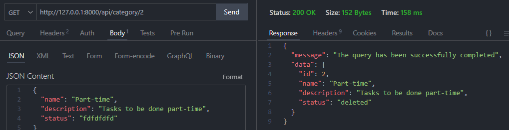

# Documentación del CRUD: Categorías

## Consultas "GET"

-   La base de datos está vacía:

-   Base de datos con datos almacenados

-   Consultar categoría por su ID

## Consultas "POST"

-   Los datos son requeridos (Validaciones)

-   La categoría se ha insertado correctamente

-   No repetir el nombre al insertar

## Consultas "PUT"

-   La categoría a actualizar no existe

-   Los datos son requeridos (Validaciones)

-   La categoría se ha actualizado

## Consultas "DELETE"

-   La categoría a eliminar no existe

-   La categoría se ha eliminado

