# Documentación del CRUD: Tareas

## Consultas "GET"

-   La base de datos está vacía:

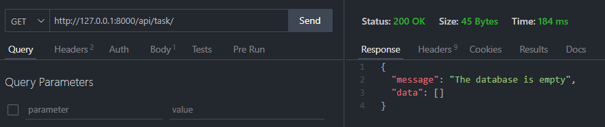

-   Base de datos con datos almacenados

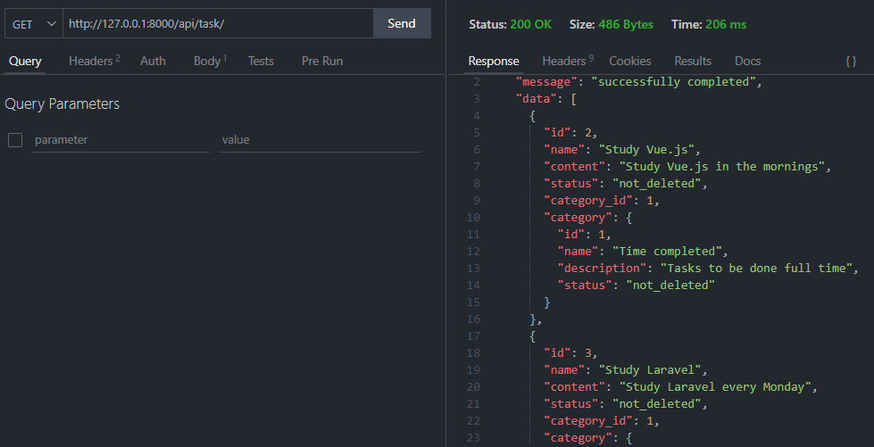

-   Consultar tarea por su ID

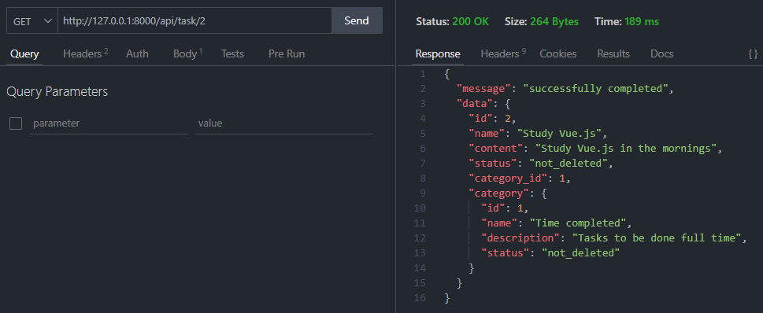

## Consultas "POST"

-   Los datos son requeridos (Validaciones)

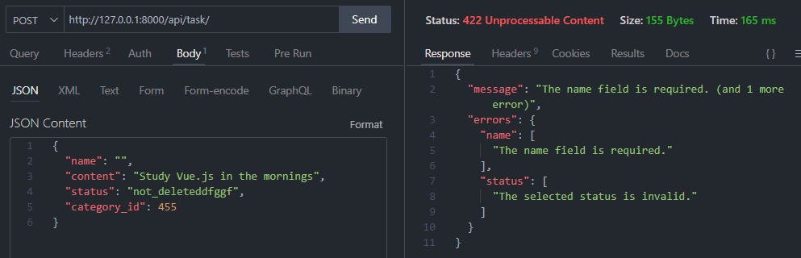

-   La tarea se ha insertado correctamente

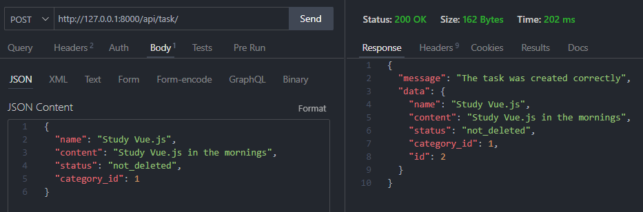

-   No repetir el nombre al insertar

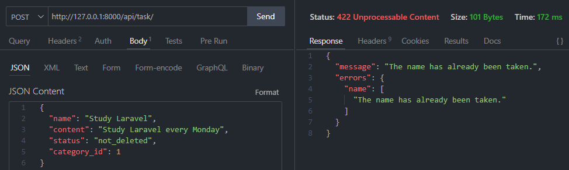

-   La categoría no existe

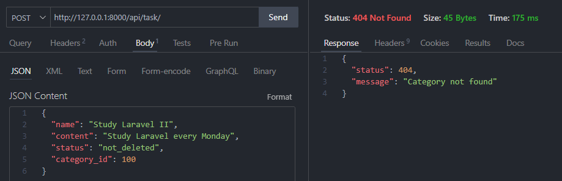

## Consultas "PUT"

-   La tarea a actualizar no existe

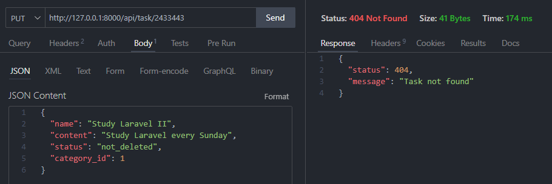

-   La categoría no existe

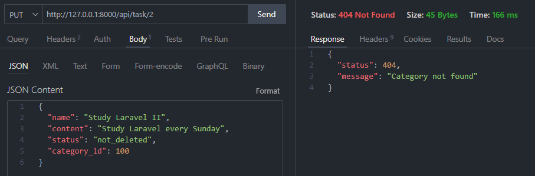

-   Los datos son requeridos (Validaciones)

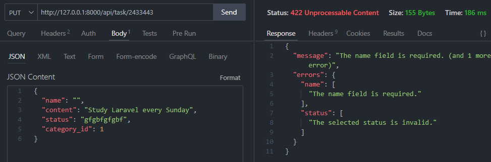

-   La tarea se ha actualizado

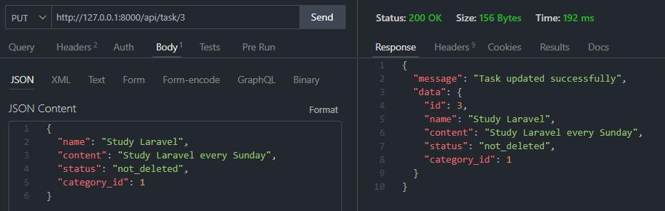

## Consultas "DELETE"

-   La tarea a eliminar no existe

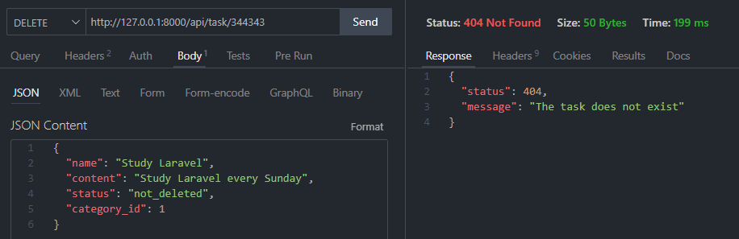

-   La tarea se ha eliminado

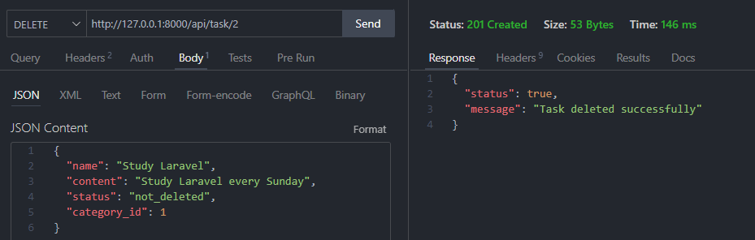
